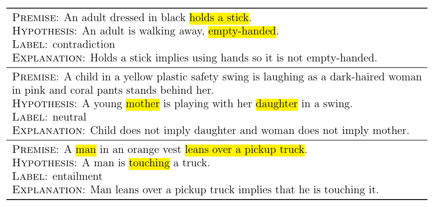
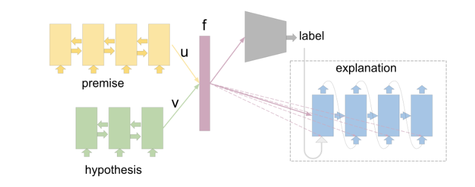
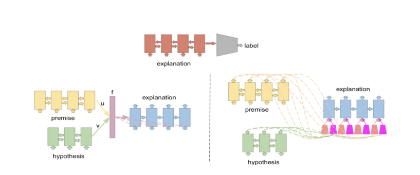
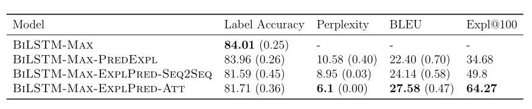
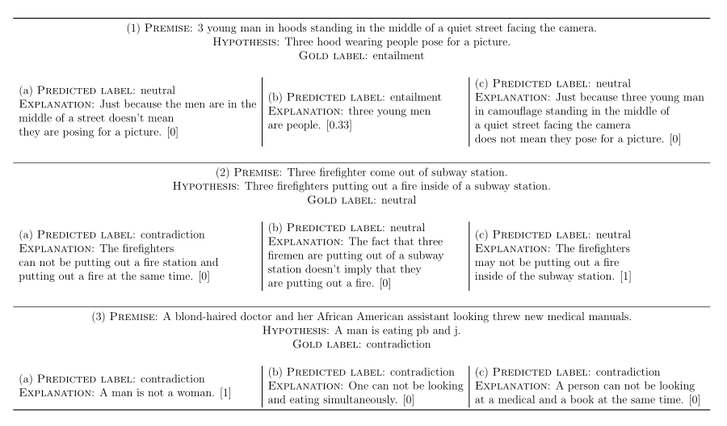
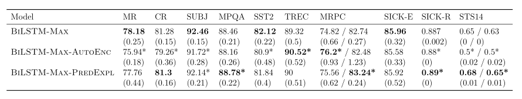

# 第五章 生成自然语言解释的神经网络

在本章中，我将基于(Camburu et al.， 2018)探索自我解释的神经模型。更准确地说，我调查了如果在训练时对真实标签额外给予自然语言解释，神经模型是否能改善它们的行为，以及这些模型是否能在测试时对它们的预测做出这样的解释。

## 5.1 动机

正如在第一章中提到的，简单地训练以获得在外拉集上的高精度的模型往往会学会依赖浅输入统计量，从而导致模型的脆性。例如，Ribeiro等人(2016)提出了一种区分基督教和无神论的文档分类器，其测试准确率为94%。然而，仔细观察，该模型基于包含在标题中的单词(如“post”、“Host”和“Re”)将类分离。在训练集和测试集的假相关性允许这样的不期望的模型获得高精确度。更复杂的隐藏关联可能存在于任意大型的人工注释数据集中(Gururangan等人，2018年;Bhathena等人，2020年;陈等，2016a;Levy和Dagan, 2016年;Cai等，2017)。这种相关性可能很难发现，即使人们发现了它们，如何减轻它们也是一个悬而未决的问题(Belinkov等人，2019年)。

​		在这一章中，我调查了一个方向，这个方向有可能使神经模型远离依赖虚假的相关性，并为这些模型的预测提供解释。这个方向是增强神经模型的能力，使其能够在训练期间学习自然语言解释，并在测试时生成这些解释。对于人类来说，解释在构建分类和泛化的概念表征方面发挥着关键作用(Williams和Lombrozo, 2010;Lombrozo, 2009)。人类也从第一次在一个环境中行动之前阅读解释中获益良多(Tsividis等人，2017)。因此，解释也可以用来建立一个模型在一个更好的初始位置，以进一步学习正确的功能。同时，在测试时，生成正确的论证，获得较高的精度，有可能使模型具有更高的透明度和信任度。

​		将外部知识纳入神经模型可以产生更健壮的模型(Glockner等，2018b)。自由形式的自然语言解释是一种外部知识的形式，它比形式语言有以下优点。首先，人类很容易提供自由形式的语言，从而消除了学习生成正式语言的额外努力，从而使收集此类数据集变得更简单。其次，自然语言解释可能潜在地从现有的大规模自由格式文本中挖掘出来。最后，对于需要断言模型可靠性的终端用户来说，自然语言是容易理解的。

​		尽管自然语言解释在提高学习能力和透明度方面具有潜力，但正如2.2.4节中所讨论的那样，社区中此类数据集仍然很稀缺。为了解决这个不足，我为SNLI数据集收集了一个巨大的、包含~ 570K人类注释的解释的语料库(Bowman et al.， 2015)。我选择SNLI是因为它构成了自然语言理解的一个有影响力的语料库，而自然语言理解需要对常识性知识的细微差别进行深度同化。我把这个解释-扩充数据集叫做e-SNLI，我公开发布这个数据集是为了推动用自由形式的自然语言解释训练和生成方面的研究。

​		其次，我要说明的是，对于一个神经模型来说，基于虚假的关联产生正确的自然语言解释，要比基于这种关联产生正确的标签困难得多。

​		第三，我开发了预测标签并对其预测做出解释的模型，并调查所产生解释的正确性。

​		最后，我研究了训练一个具有自然语言解释的神经模型是否可以产生更好的由该模型产生的通用语句表示，以及在域外数据集上有更好的性能。

**注意** 在这一章中，我用正确解释的概念来指代一个实例的真实标记的正确论证。这不应与忠实解释的概念相混淆，忠实解释是指解释描述模型决策过程的准确性，如2.4节所述。神经模型产生正确解释的能力是此类模型发展的一个重要方面。例如，在实践中有时需要正确的论证，以及正确的最终答案。因此，在这一章中，我将检视所介绍的神经模型所产生的解释的正确性。在下一章中，我将进一步证实这些解释的真实性。

## 5.2 背景

识别文本蕴涵是一项重要的自然语言理解任务。给定一对被称为前提和假设的句子，任务包括将它们之间的关系划分为(a)暗含，如果前提与假设相辅相成;(b)矛盾，如果假设与前提相矛盾;(c)中性，如果既不存在暗含也不存在矛盾。例如，前提“两个医生给病人做手术。”和假设“两个医生正在给一个人做手术。”构成一个中性的一对(因为如果病人是人，我们无法从前提中推断)。SNLI数据集(Bowman et al.， 2015)包含约570K 61个人类生成的三元组(前提、假设、标签)实例，驱动了大量神经模型的开发(Rockt¨aschel et al.， 2015;Nie和Bansal, 2017年;Parikh等人，2016;Chen等，2016b;Liu et al.， 2016;Chen等，2018b;Conneau等，2017)。

​		此外，SNLI的力量超越了自然语言推理的任务。Conneau等人(2017)表明，训练一个模型在SNLI上生成通用句子表示，与某些训练方法相比，在一个数量级更大但无监督的数据集上可以更有效、更准确(Kiros等人，2015;Hill等，2016)。在5.4.4节中，我进一步研究了自然语言解释的附加层是否可以带来进一步的改进。

​		最近，对SNLI数据集中的虚假相关性以及不同模型如何依赖这些相关性进行了越来越多的分析(Bhathena等人，2020;Gururangan等人，2018年;Glockner等，2018b)。特别是Gururangan et al。(2018)表明,特定的单词假设往往是强大的指标的标签,例如,“friend”和“old”经常出现在中性假设,“animal”和“outdoor”大多数时候出现在暗含的假设,而“nobody”和“sleep”大多出现在矛盾的假设。他们还表明，一个不确定前提的模型，即，一个只接受假设作为输入并预测标签的模型，可以获得67%的测试准确率。在5.4.1节中，我展示了依靠虚假的相关性来产生解释要比产生标签困难得多。

## 5.3 e-SNLI数据集

在本节中，我将介绍我在亚马逊土耳其机器人上收集e-SNLI的方法。这个数据集必须回答的主要问题是:为什么一对句子是隐含、中立或矛盾的关系?我鼓励注释者把重点放在突出的元素上，这些元素引导出给定的关系，而不是在前提和假设中重复相同的部分。我也问他们去解释假设中没有出现在前提中的所有部分。另外，我要求注释者提供独立的解释，而不是只有在阅读了前提和假设之后才有意义的句子。例如，对这种形式的解释是“Anyone can knit，not just women。”，而不是“It cannot be inferred they are women”。

图5.1:来自e-SNLI数据集的例子。注释者得到了前提、假设和标签。他们强调了他们认为对标签至关重要的词语，并提供了解释。

​		收集这个数据集的主要挑战是，在众包中，很难控制自由形式注解的质量。作为一种解决方案，我通过浏览器内检查预先阻止了明显不正确的解释的提交。例如，除非每个解释至少包含三个标记，而且不是前提或假设的副本，否则注释者不允许提交。指导注释者提供正确解释的第二种方法是要求他们分两个步骤进行。首先，他们被要求标出他们认为对给定关系至关重要的前提或假设中的单词。其次，注释者必须用他们强调的词语来表述每一个解释。执行浏览器内检查，以确保高亮显示的单词数量最少，并且至少有一半高亮显示的单词在解释中使用，以便解释与主题一致。为了说明每个关系的特殊性，需要突出显示的最小单词数量依赖于该关系。对于隐含对，注释者被要求从前提中突出至少一个词。注释者也被鼓励(但不是必须)标出假设中的单词。对于矛盾对，他们被要求在前提和假设中至少突出一个词。对于中性组，他们被要求在假设中至少突出一个词，而不允许他们突出假设中的词。引入这一特定约束是为了防止工人混淆前提和假设。中性配对经常让人感到困惑，因为注释者很容易从假设中找不到的前提去关注细节，而不是反过来。这不是矛盾对的情况，因为实体之间的矛盾关系通常是对称的，也不是隐含对的情况，因为隐含对的实体之间的关系是直观的(例如，人会自然地说“dog is an animal”。而不是“An animal is a dog.”)。因此，要求注释者用每个关联特有的限制来突出词语，这对于将注释者置于正确的思维模式中特别有用，而且还提供了一种过滤不正确解释的方法。此外，突出显示的单词也可能提供宝贵的未来资源，例如，为注意力模型提供监督或评估它们(Rockt¨aschel et al.， 2015;Parikh等，2016)。最后，一个浏览器内检查也验证了注释者使用的不是突出显示的单词，因为正确的解释需要将这些单词之间的链接清晰地表达出来。

​		我为训练集中的每个实例收集了一个解释，为验证和测试集中的每个实例收集了三个解释。表5.1展示了收集到的解释的例子。6325人，平均每人86±403个解释。

​		请注意，一个可以自动产生的解释，比如“Just because[entire premise]doesn't mean[entire hypothesis]”(对于中性对)，“[entire]implies[entire hypothesis·]”(对于隐含对)，或者“It can either be[entire premise]or[entire hypothesis]”(对于矛盾对)，都是没有信息的。因此，我收集了一个可能的模板列表，如附录B所示，用于过滤这种无信息解释的数据集。更准确地说，如果某个模板的编辑距离小于10个字符，我过滤了解释。我在整个数据集上运行了这个模板检测，并重新注释了检测到的解释(总共11%)。

**收集的解释的质量。**为了衡量所收集解释的质量，我随机抽取了1000个例子，并手动将其正确性在0(不正确)和1(正确)之间打分。为了潜在，一个解释收到了一个潜在的部分分数$\frac{k}{n}$，n个参数中有k个被提到了。对于中性和矛盾对，一个正确的论证就足以得出一个正确的解释。

​		注释的总错误率为9.6%，隐含错误率为19.5%，中性错误率为7.3%，矛盾对错误率为9.4%。隐含对的较高错误率首先是由于部分的解释，因为注释者有动机提供更短的输入，所以他们经常只提到一个参数。第二个原因是，许多隐含对的假设几乎是前提的子集，促使注释者解释前提或假设。严格地说，这不会是一个错误，因为在这些情况下，没有什么突出的解释。然而，在这个注释中它被认为是一个错误，因为人们仍然可以制定一个类似于论证的解释，而不是简单地解释输入。未来的工作可能会研究自动检测不正确解释的方法，这样人们就可以重新注释它们。

## 5.4 实验

在本节中，我将执行一系列实验，以研究神经模型从e-SNLI中的自然语言解释中学习以及在测试时生成此类解释的能力。首先，我要说明的是，一个依赖SNLI中虚假相关性来提供正确标签的模型，也不能基于这些相关性提供正确的解释。进一步的实验阐明e-SNLI模型训练是否能够:(i)预测标签,并对于预测标签生成一个解释(2)生成一个解释，然后根据生成的解释预测标签(3)学习更好通用句子表示,(iv)在源域之外的自然语言推理的数据集表现得更好。

​		在整个实验过程中，模型很大程度上遵循了Conneau等人(2017)的BiLSTM-Max模型的架构。更准确地说，BiLSTM- max使用两个内部大小为2048的双向长短期记忆循环单元(BiLSTM)分别对前提和假设进行编码(Hochreiter和Schmidhuber, 1997;舒斯特尔和帕利瓦尔，1997)。使用时间步上的最大池化来获取每个句子的向量表示(维度$2·2048 = 4096$，由于双向性)。设u为前提的向量表示，v为假设的向量表示。最后的特征向量是$f = [u,v，|u−v|，u\bigodot v]$，它被传递到一个多层感知器(MLP)，有三层，每层尺寸为512，没有非线性，它预测标签。这是SNLI经常采用的一个典型的高层架构(Bowman et al.， 2015)。

​		为了生成解释，我使用了一个单层的LSTM模块，它的内部大小是一个超参数，值在{512,1024,2048,4096}之间。我也尝试了门控循环单元(GRUs) (Cho等人，2014)作为解码器，然而，LSTMs单元在所有实验中表现最好。循环dropout(Srivastava et al.， 2014)也应用于解释解码器，其比率固定在0.5。

​		为了减少生成解释的输出词汇表的大小，将在解释训练集中出现次数少于15次的标记替换为\<UNK>，从而产生一个∼12K标记的输出词汇表。

​		预处理和优化与Conneau等人(2017)的方法相同。特别是，为了将句子输入到模型中，在实验过程中使用并固定了已经训练好的GloVe词嵌入(Pennington et al.， 2014)。前提和假设被切割为最多84个token，而解释最多40个token(这些限制是根据数据集的统计来决定的)。

​		所有模型均采用随机梯度下降(SGD)训练，学习率从0.1开始，每epoch衰减0.99倍。我尝试过Adam optimizer (Kingma and Ba, 2014)，但是SGD在所有的实验中表现最好。批大小固定在64。

​		对于大多数实验，我使用5个种子作为随机数生成器，并使用圆括号中的标准差来提供平均性能。如果没有报告标准偏差，则结果仅来自一颗种子。

### 5.4.1 前提不可知

Gururangan等人(2018)表明，一个仅能获得假设的神经模型可以依靠SNLI中的假相关性预测67%的正确标签。因此，评估一个模型在多大程度上也可以依赖虚假的相关性来产生正确的解释是很有趣的。

**模型。**Hyp2Expl模型由一个具有最大池的BiLSTM编码器和一个LSTM解码器组成，前者为假设提供向量表示，而LSTM解码器则将这种表示作为其初始状态和每个时间步的额外输入，并生成解释。

​		为了进行公平的比较，我还为假设的编码器分别训练了一个具有相同体系结构的模型，但随后是用于预测标签而不是生成解释的3层MLP。我称之为Hyp2Lbl。该模型不执行超参数搜索。

**模型选择。**Hyp2Expl的超参数是解码器的内部大小(如上所述，值为512、1024、2048和4096)。模型选择是通过验证集的复杂度来实现的，当译码器的大小增加时，验证集的复杂度严格减小。然而，由于实际的原因，译码器内部大小没有增加到4096以上，这是这个模型的超参数的选择值。

图5.2:BiLSTM-Max-PredExpl模型的架构

**结果**。我手工检查了Hyp2Expl对前100个测试实例生成的解释，正确性得分仅为6.83。另一方面，Hyp2Lbl对同一实例获得了66个正确标签。这验证了直觉，它是更加困难的(大约10倍于这个架构)依赖虚假的相关性来产生正确的解释，而不是依赖这些相关性来预测正确的标签。

### 5.4.2 预测后解释

在这个实验中，我研究了神经模型为其预测生成自然语言解释的能力。

**模型**。我使用解释生成器增强了BiLSTM-Max模型，方法是将特征向量**f**简单地连接到单层LSTM解码器，既作为初始状态，又在每个时间步中连接到字嵌入输入。我称这个模型为BiLSTM-Max-PredExpl。为了将解释限定在标签上，在解码器的第一个时间步输入标签(如“隐含”、“矛盾”或“中立”)。在训练时，提供了真实标签，测试时间，使用模型预测的标签。此体系结构如图5.2所示。

**Loss function。**分类损失和解释损失均采用负对数似然法。请注意，解释损失比分类损失在量级上要大得多，这是由于解释中大量词语的负对数概率之和。为了在训练时考虑到这一差异，我们使用了权系数$\alpha \in [0,1]$，使得总损失为
$$
L_{total}=\alpha L_{label}+(1-\alpha)L_{explanation} \tag{5.1}
$$
**模型选择。**在这个实验中，超参数是解码器的内部大小，$\alpha$(我选择的值从0.1到0.9，步长为0.1)和learning rate(同样，取值在512、1024、2048和4096之间)。为了考察一个模型在不牺牲预测精度的情况下如何产生解释，本实验仅以标签精度作为模型选择的标准。作为未来的工作，可以检查标签和解释性能之间的不同权衡。当$\alpha = 0.6$和解码器内部尺寸为512时，得到的最佳验证精度为84.37%。

**结果。**在5种以上种子中，BiLSTM-Max的测试精度为84.01%(0.25)。而BiLSTM-Max-PredExpl模型的测试精度基本相同，为83.96%(0.26)，这表明可以在不牺牲标签精度的情况下获得额外的解释。

​		对于生成的解释，测试混乱度为10.58 (0.40)，BLEU(双语评价替补)得分(Papineni et al.， 2002)为22.40(0.70)。由于e-SNLI对验证和测试集中的每个实例都有三种解释，因此可以通过计算第三种解释相对于前两种解释的BLEU分数来获得一个内部注释者的BLEU分数。通过这种方式，我获得了一个内部注释BLEU的22.51分。为了一致性，在计算生成的解释的BLEU分数时，我使用了同样的两种解释作为参考。

​		鉴于内部注释者的分数很低，并且生成的解释的BLEU分数几乎与内部注释者的BLEU分数相匹配，我们可以看出，这个指标在评估生成解释的质量和正确性方面是不可靠的。因此，我手工注释了测试集中的前100个实例(遵循与5.3部分相同的部分评分)。由于解释是以预测的标签为条件的，所以当模型预测不正确的标签时，就不能期望它生成正确的解释。因此，解释的正确度量是预测标签正确的子集中正确解释的百分比。对于测试集中的前100个实例，正确解释BiLSTM-Max-PredExpl的百分比只有34.68%(在模型预测正确标签的80个实例中)。虽然这个百分比非常低，但是应该记住，对于BiLSTM-Max-PredExpl的选择标准仅仅是标签的准确性。在下一个实验中，我将展示如何在预测的标签也是正确的情况下，仅为生成解释而进行选择(和训练)，从而获得更高的正确解释百分比。

### 5.4.3 解释后预测

在之前的实验中，BiLSTM-Max-PredExpl生成了一个基于其预测标签的解释。然而，这种类型的模型可能不能提供忠于模型决策过程的解释。例如，解释生成器不能访问分类器的内部工作(参见图5.2)。为了增加获得忠实解释的概率，可以将标签预测和解释生成的顺序颠倒过来。因此，我提出了一个模型，首先给出一对(前提、假设)来生成一个解释，然后预测一个只给出生成解释的标签。我将这种类型的模型称为BiLSTM-Max-ExplPred，下面将提供它的两个版本。对于e-SNLI数据集，这是一种合理的分解，因为有以下关键观察结果:对于e-SNLI，可以很容易地检测为哪个标签提供了解释。这可能不是一般的情况，因为同样的解释可以正确地证明不同的标签，这取决于前提和假设。例如，“A women is a person。“这对于隐含的一对来说都是正确的解释(“A women is in the park”，“A person is in the park”)和矛盾组(“A women is in the park”，“There is no person in the park”)。然而，有多种解释方式。在我们的例子中，对于矛盾对，一个人也可以解释“There cannot be no person in the park if a women is in the park”，单独阅读就可以推断出这一对是矛盾的。后一种解释在e-SNLI数据集中占主导地位。

**模型。**对于模型BiLSTM-Max-ExplPred的部分，我提出了两个架构，它可以预测给出一个前提和一个假设的解释。首先，BiLSTM-Max-ExplPred-Seq2Seq是一个简单的序列到序列模型。本质上，它与BiLSTM-Max-PredExpl相同，但是没有MLP分类器(在解释之前没有标签)。其次，BiLSTM-Max-ExplPred-Att是这个BiLSTM-Max-ExplPred-Seq2Seq的关注版。神经网络中的注意机制在不同领域对非注意对立部分带来了持续的改进，例如计算机视觉(Xu et al.， 2015)、演讲(Chan et al.， 2016)和自然语言处理(Gong et al.， 2018;(Bahdanau等，2015)。类似于BiLSTM-Max-ExplPred-Seq2Seq，编码器是两个2048-BiLSTM单元，解码器是单层LSTM。不同之处在于，BiLSTM-Max-ExplPred-Att在生成解释时，使用两个独立但相同的注意力头来关注来自前提和假设的token。最后，我训练了一个名为ExplToLbl的神经模型，它只给出一个解释就能预测一个标签。ExplToLbl由最大拉码编码器2048-BiLSTM和3层MLP分类器组成，测试精度为96.83%。这种高测试精度证明了将该模型分解为两个独立模块是合理的。图5.3展示了该模型的两个版本。

图5.3:BiLSTM-Max-ExplPred两个版本的架构。最上面的是ExplToLbl模型，它仅根据一个解释来预测一个标签。左边是BiLSTM-Max-ExplPred-Seq2Seq模型。右边是BiLSTM-Max-ExplPred-Att模型。

**模型选择** 在这个实验中唯一的超参数是解码器的内部尺寸。模型选择准则是对e-SNLI验证集的混乱度。内部尺寸为1024时，得到了BiLSTM-Max-ExplPred-Seq2Seq和BiLSTM-Max-ExplPred-Att的最佳混乱度度。

**结果** 通过上述设置，标签精度从BiLSTM-Max-PredExpl中的83.96%(0.26)下降到BiLSTM-Max-ExplPredSeq2Seq中的81.59%(0.45)和BiLSTM-Max-ExplPred-Att中的81.71%(0.36)。而对测试集中前100个实例生成的解释进行手工注释，其正确解释的比例显著提高:BiLSTMMax-ExplPred-Seq2Seq为49.8%，BiLSTM-Max-ExplPred-Att为64.27%。值得注意的是，模型选择只考虑对生成解释的混乱程度，而使用注意机制可以显著提高解释的质量。这个实验表明，尽管标签的准确性略有下降，但可以提高模型预测正确标签的实例所产生解释的正确性。

​		表5.1总结了所有模型的结果。

表5.1:BiLSTM-Max- predexpl、BiLSTM-MaxExplPred和BiLSTM-Max基线的性能。平均值超过5个种子，标准差在括号内。Expl@100是在e-SNLI测试集的前100个实例中，模型预测到正确标签的实例子集中，正确解释的百分比。解释的正确性是通过人工注释获得的。粗体是最好的结果。

**定性分析。**在表5.2中，可以看到(a) BiLSTM-Max-PredExpl， (b) BiLSTM-Max-ExplPred-Seq2Seq和(c) BiLSTM-Max-ExplPred-Att产生的解释的例子。在每个解释的结尾，括号中是我手动分配的分数，如5.3节所述。请注意，对于所有三种模型的解释主要是关于主题的，只有少数例外，比如(1c)中提到的“伪装”。还要注意，即使是错误的，产生的解释有时也会令人沮丧地接近正确。例如，在20个单词中，解释(2b)只差一个单词就对了。

​		当预测的标签不正确时，检查所提供的解释也是有趣的。例如，在(1a)中，我们看到网络从前提中省略了“面对摄像机”的信息，因此将这对组合归类为中性的，这是由其本身在其他方面正确的解释所支持的。我们还看到model BiLSTM-Max-ExplPred-Seq2Seq正确地将这一对分类为entailment。然而，它只生成了导致隐含性的三个必要论据中的一个，而且它还挑选了可能最简单的论据。另一方面，注意力模型认为这种情况(1c)是中性的，并认为“站着”和“面对相机”并不足以得出“摆姿势拍照”的结论，而人类则认为这种情况是含蓄的。然而，这些解释也提到了“伪装”，这和连帽衫不一定一样。因此，我将此解释标注为不正确(括号中为0分)。

表5.2:从(a) BiLSTMMax-PredExpl， (b) BiLSTM-Max-ExplPred-Seq2Seq和(c) BiLSTMMax-ExplPred-Att中预测标签和生成解释的例子。括号中是正确性得分，部分得分如5.3节所述。

虽然还需要更多的研究来了解产生的解释是否为模型的决策过程提供了可靠的线索，但令人欣慰的是，这些解释是可信的。

### 5.4.4 通用的句子表示

获取通用句子表示是训练编码器提供短语/句子语义上有意义的定长表示的任务(Kiros et al.， 2015;Hill等人，2016年;Conneau等，2017)。这些表示在其他下游任务中进一步作为特征使用，特别是在缺少标记训练数据的任务中。在计算机视觉中，预先训练的基于imagenet的编码器为其他下游任务提供标准的图像特征提取器(Deng et al.， 2009)。然而，在自然语言处理中，对于通用的句子编码器仍然没有共识。这是一个开放的问题，在哪个任务和数据集应该训练这样的编码器。传统方法利用74个非常大的无监督数据集，需要数周的训练(Kiros et al.， 2015)。最近，Conneau等人(2017)表明，仅对自然语言推理进行训练，比对数量级较大但无监督数据集进行训练更准确、更省时。他们的结果鼓励了这样一种想法，即更多的监督可能比更大但没有监督的数据集更有益。因此，研究以自然语言解释的形式增加一层监督是否能进一步提高普遍句子表征的学习是很有意义的。

**模型** 我使用5.4.2节中训练过的BiLSTM-Max-PredExpl模型。为了确保BiLSTM-Max- predexpl比BiLSTM-Max的潜在改进来自于解释，而不仅仅是添加了语言解码器，我将介绍BiLSTM-Max- autoenc模型作为额外的基线。BiLSTMMax-AutoEnc遵循与BiLSTM-Max-PredExpl相同的架构，但是它没有使用解码解释，而是使用一个共享的LSTM解码器从它们对应的向量表示中解码前提和假设。对于BiLSTMMax-AutoEnc，我使用与BiLSTM-Max-PredExpl相同的hypeparameters。

**评价指标** 通常情况下，句子表示法是通过将它们作为固定的特征来评估的，浅层分类器在此基础上进行训练，以执行一系列下游任务。Conneau等人(2017)提供了一个优秀的工具，用于评估10种不同任务的句子表征:电影评论(MR)、产品评论(CR)、主观性/客观性(SUBJ)、意见极性(MPQA)、问题类型(TREC)、情绪分析(SST)、语义文本相似性(STS)、释义检测(MRPC)、隐含(sicke)和语义相关性(sickr)。MRPC用accuracy/ f1评分进行评估。用Pearson/Spearman相关性评估STS14。用皮尔逊相关来评估SICK-R。对于所有其他任务，精确性用于性能评估。这些任务和评估工具的详细描述可以在他们的论文中找到。

表5.3:BiLSTM-Max-PredExpl以及基线BiLSTMMax和BiLSTM-Max-AutoEnc在10个下游任务上的性能。结果是5次不同种子运行的平均值，标准差在括号中显示。每个任务的最佳结果用粗体表示。' * '表示与基线相比，在0.05水平上存在显著差异。

**结果**  表5.3显示了BiLSTM-Max- predexpl、BiLSTM-Max和BiLSTM-Max- autoenc对上述10个下游任务的结果(平均值超过5个用不同种子训练的模型，标准差在括号内)。为了检验BiLSTM-MaxAutoEnc和BiLSTM-Max- predexpl与BiLSTM-Max基线之间的性能差异是否显著，我进行了Welch 's t检验。5在0.05显著性水平下显着的结果用“*”表示。

我们看到，在6个任务上，BiLSTM-Max-AutoEnc的性能显著低于BiLSTMMax，而在两个任务上显著优于它。这表明添加语言生成器实际上会损害性能。相反，BiLSTMMax-PredExpl在四个任务上显著优于BiLSTM-Max，而在一个任务上显著优于它。因此，我们可以得出结论，解释训练有助于模型学习整体更好的句子表征。

### 5.4.5 域外数据集的性能

众所周知，在一个实例分布上训练的模型在另一个实例分布上的性能并不好。例如，Bowman等人(2015)在对SNLI模型进行训练并对其进行disease - e评估时仅获得了46.7%的准确性(Marelli et al.， 2014)。因此，研究解释是否能帮助模型在域外数据集上提高其在标签预测和解释生成方面的性能是很有趣的。我使用了SICK-E数据集以及MultiNLI数据集。

**模型**  我使用5.4.2节中训练过的BiLSTM-Max-PredExpl模型。作为基线，我再次使用已经训练好的BiLSTM-Max和BiLSTM-MaxAutoEnc模型。

**结果**  表5.4显示了在不对SICKE和多项进行微调的情况下对BiLSTM-Max-PredExpl、BiLSTMMax和BiLSTM-Max-AutoEnc进行评估时的性能。我们看到使用BiLSTM-MaxPredExpl获得的改进非常小。因此，我们不能得出结论的有效性的解释，以提高性能的模型的领域外数据集。

​		为了评估BiLSTM-Max-PredExpl生成正确自然语言解释的能力，我手工注释了这个模型为test set中的前100个实例生成的解释。标签被正确预测的子集中正确解释的百分比为30.64%，而对多项的正确解释只有1.92%。在注释过程中，我注意到在SICK-E中的解释，即使是错误的，一般都是切题的、有效的陈述，而在多项中的解释一般都是无意义的或离题的。这并不奇怪，因为与多项相比，SICK-E不那么复杂，更类似于SNLI。

## 结论和开放性问题

在本章中，我介绍了e-SNLI，这是一个巨大的数据集，包含~ 570K人类编写的自然语言解释，用于有影响力的自然语言推理任务。我说过，对于一个神经模型来说，基于SNLI中虚假的相关产生正确的标签，要基于这些相关产生正确的解释是非常困难的。这带来了经验证据，证明产生正确解释的模型比只预测正确标签的模型更可靠。

​		我实现了各种模型，为它们的标签预测生成自然语言解释，并量化了这些模型在预测正确的标签时生成正确解释的能力。我还研究了在训练时间提供这些解释的有用性，以获得更好的通用语句表示，并提高了在域外数据集上的模型的性能。

​		因此，本章所描述的工作为未来发展鲁棒神经模型铺平了道路，该模型可以在训练时从自然语言解释中学习，也可以在测试时生成正确的自然语言解释。此外，e-SNLI数据集还可以用于其他目的。例如，与Das等人(2016)对可视化问题回答的评估相似，e-SNLI中突出显示的标记可能为注意力模型提供监督和评估来源(Rockt¨aschel等，2015;Parikh等，2016)。

​		如何自动评估生成的解释的质量仍然是一个有待解决的问题，因为我们已经看到，自动的衡量标准，例如BLUE分数，是不合适的。

​		如何验证生成的解释是否忠实地描述了模型的决策过程也是一个开放的问题。