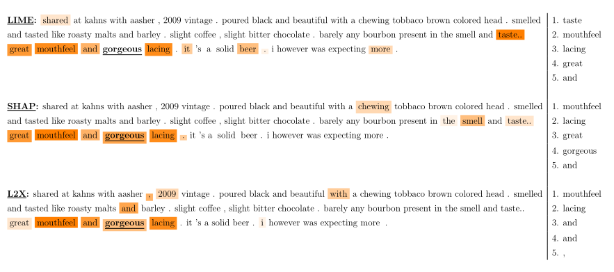

# 第四章 验证基于特征的事后解释方法

在本章中，基于(Camburu et al.， 2019)，我将介绍一个框架来验证基于特征的事后解释方法对其目标解释模型的决策过程的准确性。

## 4.1 动机

正如我们在第2章中看到的，最近开发了大量基于特征的事后解释方法，目的是阐明通过神经模型学习的决策过程(Ribeiro et al.， 2016;伦德伯格和李，2017年;Lapuschkin等人，2015年;Shrikumar等人，2017年;Sundararajan等人，2017;Simonyan等，2014;里贝罗等人，2018年;Chen等，2018a;Chen and Jordan, 2020)。虽然目前的解释器设法指出某些模型的灾难性的偏差,比如依靠图像的背景来区分狼和哈士奇(里贝罗et al ., 2016),一个开放的问题是如何验证这些方法是否忠实地，低偏差地描述模型的决策过程。这是一项艰巨的任务，因为一般来说，深度神经网络的决策过程是未知的。因此,解释方法的自动验证通常要么依赖简单的场景(一个可翻译的但琐碎的目标模型,如线性回归模型,或一个在合成数据集训练的非平凡的目标模型),或假设准确的目标模型必须做出理智的行为,也就是说,他们不依赖于数据集中的伪相关性。例如,在他们的验证测试基于morphosyntactic协议,Poerner et al。(2018)假设根据动词前面的token预测动词是单数还是复数的一种模型，该模型必须通过将注意力集中确定为主语的名词上。这些假设可能不太好，因为最近的研究表明，神经网络能够学会依赖令人惊讶的虚假关联，即使它们提供了正确的答案(Gururangan等人，2018;McCoy等人，2019年;Glockner等，2018a)。因此，仅仅根据解释是否符合手头任务的要求来验证解释器的真实性是不可靠的。

​		为了克服这些问题，我建议使用第3章中介绍的选择器-预测器模型，因为它有可能为每一个预测提供一组相关和不相关的特征。此外，这种类型的模型是一个可以在真实数据集上训练的非平凡的神经模型。然而，正如我们在前一章看到的，选择器-预测器模型可能有一定的限制，当使用它们作为验证解释器的试验台时，需要考虑到这些限制。因此，我引入检查来说明其中一些限制，以及可以进行进一步改进以减轻剩余的限制。

​		我在Lei等人(2016)引入的选择器-预测器模型上实例化了SelPredVerif框架，并在BeerAdvocate数据集(McAuley et al.， 2012)上进行了多方面情绪分析的训练。因此，我生成了三个完整性测试，分别针对BeerAdvocate中的每个方面。此外，我测试了三个流行的解释器，即LIME (Ribeiro et al.， 2016)、KernalSHAP (Lundberg and Lee, 2017)和L2X (Chen et al.， 2018a)，并提供他们在这三个测试中的表现，以提高对这些解释器可能产生的不忠实解释的认识。

​		这三个完备性测试可以用于测试现有的和将来基于特性的事后解释方法。此外，SelPredVerif是通用的，可以在其他任务、领域域和神经结构上实例化，用于选择器和预测器网络，从而生成大量的完备性测试。

## 4.2 最近的工作

尽管被提出的解释方法越来越多，但如何彻底验证它们与它们所要解释的目标模型的一致性仍然是一个开放的问题。通常有四种类型的验证:

1. **可解释但简单的目标模型**。通常，解释者通过线性回归和决策树(如Ribeiro et al.(2016))或支持向量表示(如Plumb et al.(2018))进行测试。虽然这种评估准确地评估了解释者对目标模型的忠诚度，但这些非常简单的模型可能不能代表实际中使用的大型和复杂的神经网络。
2. **综合设置**。另一种流行的设置是创建控制重要特征集的合成任务(Chen et al.， 2018a;Yoon等人，2019年;伦德伯格和李，2017)。例如，Chen等人(2018a)对四个综合任务进行了评估。虽然在这些设置中训练的目标模型的复杂性没有限制，但它们的合成特性仍可能促使目标模型学习比实际应用所需的更简单的功能。反过来，这可能会减轻解释器的工作。
3. **假设目标模型的合理行为**。在这种情况下，一个人确定了某些直觉的启发，一个高性能的目标模型被假定遵循。例如，Chen等人(2018a)假设，在情绪分析方面表现良好的神经网络必须依赖传达预测情绪的标记。同样，Poerner等人(2018)认为，一个能很好地判断一个动词是单数还是复数的神经网络，必须依赖于一个与模型确定为动词主语的相同数量的名词。因此，在这个评价程序中，是根据解释器是否指出了与模型的预测具有真实相关性的特征来评价解释者的。然而，即使神经网络获得了很高的测试精度，它们也可能依赖于令人惊讶的假相关性(Gururangan等人，2018年;Ribeiro等人，2016年;McCoy等人，2019年;Glockner等，2018a)。因此，这种类型的验证对于评估解释器对目标模型的忠诚度是不可靠的。
4. **改进人类对模型的理解**。评估解释器的一种非自动方式是检查他们的解释如何帮助人类预测目标模型的行为。在这个评估中，人类会面对一个模型的一系列预测和来自不同解释器的解释，并被要求推断模型在一组单独的例子中会做出的预测。如果人们在看到$e_1$的解释后比$e_2$的解释后更善于预测模型的输出，那么就可以得出这样的结论(Ribeiro et al.， 2018)。虽然这种类型的评估可以说是最有效的，因为它模拟了解释性方法在现实世界的使用，但如果它被应用到复杂的现实世界神经网络模型中，它是昂贵的，并且需要相当大的人力努力。因此，在进行人工评估之前，我们希望能够使用补充的自动完备性测试。

与上面的情况相反，SelPredVerif生成自动完备性测试，其中目标模型是一个在真实数据集上训练的非平凡的神经网络，并且我们知道它的部分决策过程。

​		SelPredVerif的目标与Adebayo等人(2018)引入的框架相似。然而，他们的框架测试的基本要求是，一个解释器应该对一个用真实数据训练的目标模型提供不同的解释，而不是对同一个用随机数据训练的目标模型提供不同的解释，或者对根本没有受过训练的目标模型提供不同的解释。SelPredVerif具有更大的挑战性，要求解释器对目标模型有更强的保真度。与Yang和Kim(2019)的并行工作类似，SelPredVerif检查了假阳性，即解释器是否相关性较低的特征高于相关性较高的特征。然而，他们的框架使用半合成数据集，因为他们在场景图像上随机粘贴对象，而SelPredVerif可以应用于任何真实世界的数据集。

## 4.3 验证框架

正如之前章节提到的，让$D$是我们的数据集，其中$x$实例有多个特征$x=(x_1,x_2,...,x_n)$。让$m(x)=pred(sel(x))$是一个选择器-预测器模型，定义$S^m_x:=sel(x)$为选择出的特征，没有被选择出的特征定义为$N^m_x=x/S^m_x$。目标是找到一组实例$G^m \subseteq D$，对于其中的每个实例$x$，我们已知一组特征子集对于模型$m$关于实例$x$的预测具有相关性和不具相关性，通过保证每个实例中特征的相关性的数据集$G^m$，我们可以验证解释器是否错误地将更重要的信息赋予了不相关的特征而不是相关的特征。

​		在前一章中，我展示了选择器-预测器模型的目标是通过选择的特性提供一个最小充分子集作为解释。因此，这些模型的目标是点态类型的真实值解释。因此，这个验证框架是专门为这种事实基础解释而设计的。然而，我们也看到，所选特征的极小性和充分性都不能保证。因此，如果选择了冗余的特征(如图3.1中实例$x^{(2)}$中的“nice”)，则SelPredVerif生成的完备性测试可能不会对邻区解释进行惩罚。

​		下面我将展示如何使用这样的模型作为解释器的测试台，以及随之而来的优点和局限性。

**找到一组相关特征。**这是一个开放的问题，如何检查选择的特征子集是否最小，而不需要对模型的指数数查询(对每个选择特征子集)。不能保证最低限度可能会带来以下问题:

1. 某些选定的特征可能与预测无关，

2. 某些相互抵消的特性组可能被选中，而其他的可能没有被选中。

问题(1)可能导致错误地惩罚解释器，因为他没有把一个不相关的特征置于另一个同样不相关的特征之上。为了避免这种情况，我确定了所选特征的子集，这些特征的单独缺失会显著改变预测。

更确切的说，我定义子集 ${SIR}^m_x\subseteq S^m_x$：
$$
{SIR}^m_x=\{x_i\in S^m_x:abs(pre(S^m_x/\{x_i\})-m(x)) \geq \tau \} \tag{4.1}
$$
其中$\tau$是一个阈值，$abs(·)$是绝对值。${SIR}^m_x$代表被选择出的独立相关特征（Selected Independently Relevant features），强调这些特征的相关性取决于它们的缺失是否单独影响预测。需要注意的是，仅仅因为一个选中的特性在预测中没有做出显著的改变，并不意味着这个特性是不相关的，因为它可能与其他特性结合在一起是必不可少的。因此${SIR}^m_x$并不是唯一相关的特征集。然而，仅考虑相关特征的子集就足以获得结论性的结果，我们将在4.4节中看到。

​		另一方面，在第3章中，我们看到一个特征的消除可以作为人工造成的取消的一部分影响预测。因此,这可能是存在于${SIR}^m_x$特征的特点。此外,鉴于问题(2),在某些情况下，解释器可能会(可能是错误的)受到惩罚，因为解释器将来自真实取消的特征列为比人工造成的取消更重要的特征，这是在后者没有被选择的情况下发生的。这是拟议的核查框架的一个重要限制。希望今后的工作能提供一个解决方案。在4.6节中，我提供了一种方法来减少这种极端情况发生的概率。

​		对于任何实例$x$，检入方程4.1在所选特性$|S^m_x|$的数量上花费了线性时间(这通常明显小于特性$|x|$的总数)。然而，这个检查只需要做一次，以获得一个可以应用于任意数量的解释器的现成的完整性测试。

**所选特征的充分性。**正如我们在第3章看到的，通过探测是否$m(S^m_x)= m(x)$，可以相对容易地检查所选特征的充分性。为了避免在实践中检查这个等式可能出现的噪音，对于这个验证框架，我检查更严格的条件：
$$
S^m_{S^m_x}=S^m_x \tag{4.2}
$$
证明$m(S^m_x)=m(x)$。

​		证明：如果$S^m_{S^m_x}=S^m_x$，通过应用pred()模块，我们有$pred(S^m_{S^m_x})=pred(S^m_x)$

​		因为有$m(x)=pred(S^m_x)$的约束，这上述等式可以写为$m(S^m_x)=m(x)$

**最终的数据集$G^m$。**为了获得所需的数据集$G^m$，我们首先将D修剪到一个数据集，其中通过公式4.2，对于每个实例，所选特征$S^m_x$形成一个充分的子集。从这个修剪过的数据集中，我们进一步删除$SIR^m_x=∅$的实例。因此，我们获得了数据集$G^m$，对于每个实例$x\in G^m$，(1)所选特征是一个足够的子集，(2)这些特征的一个子集${SIR}^m_x⊆S^m_x$都是独立相关的特征。

SelPredVerif检验在两个重要假设下，解释器是否将不相关的特征排在相关特征前面:(1)任何特征,不是充分子集的一部分，被认为是无关紧要(相互抵消的特征组可能不是充分子集的一部分),和(2),任何被选择出的独立相关特征被认为是有关(从人工造成的消除特征也可能被认为是相关的)。

**度量**。 让$f^{e,m}_1(x),f^{e,m}_2(x),...,f^{e,m}_{|x|}(x)$是一组由解释器返回的按照重要性排序的特征，例如$f^{e,m}_1(x)$是解释器e关于模型m对于实例x预测的最相关的特征。为了量化解释器将不相关特征排在相关特征前面的程度，可以使用以下误差度量。

**(M1) 解释器提供的最相关特征属于不相关特征的实例百分比:**
$$
{PCT}_{first}=\frac{1}{|G^m|}\sum_{x_\in G^m}1_{f_1^{e,m}\in N_x^m}
$$
这里 **1** 代表指标函数

**(M2) 至少有一个不相关特征的排序高于独立相关特征的实例的百分比:**
$$
PCT_{misrnk}=\frac{1}{G^m}\sum_{x\in G^m}1_{\exist i<j|f_i^{e,m}\in N^m_x and\ f^{e,m}_x \in {SIR}^m_x }
$$
**(M3) 不相关特征的平均数量高于独立相关特征的平均数量:**
$$
{AVG}_{misrnk}=\frac{1}{|G^m|}\sum_{x\in G^m}\sum_{i<{r}'}1_{f^{e,m}_i(x)\in N^m_x}
$$
​		其中${r}'={argmax}_j\{f^{e,m}_j(x) \in SIR^m_x\}$是排序最后的独立特征的序号

Metric ${PCT}_{first}$显示了解释器告诉我们最相关的特征是与预测无关的实例的百分比。Metric ${PCT}_{misrnk}$显示了至少有一个排序错误的百分比。${AVG}_{misrnk}$给出了每个实例非相关特征比任意一个独立相关特征排序高的平均数。

​		SelPredVerif可以总结为以下步骤，您可以使用这些步骤根据选择器和预测器模块的其他任务、数据集或架构创建新的完备性测试。

1. 选择一个任务和一组数据集D
2. 选择一个选择器-预测器模型m
3. 在数据集上训练m
4. 使用训练后固定的模型m，从数据集D中剪枝出$G^m\in D$通过移除不符合公式4.2的实例，并且进一步移除不符合公式4.1的实例(即$SIR^m_x=\varnothing$)
5. 使用上述定义的度量方式，测试解释器对m在$G^m$中的实例上的表现

 

## 4.4 试验

为了证明SelPredVerif的有效性，我在Lei et al.(2016)引入的RCNN模型上实例化了它，并将其应用于自然语言的情绪分析任务中。

**RCNN**。 一个选择器-预测器模型：

1. 选择器(在他们的论文中称为生成器)以一个文本$x$作为输入，对于每个特征(在我们的例子中是token) $xi∈x$，输出$pi∈[0,1]$。然后，$p_i$作为一个伯努利分布模型的参数，表征$x_i$选择的概率，和

2. 预测器(在他们的论文中称为编码器)以$S^m_x= {xi∼Bernoulli(p_i)}$(测试时$S^m_x= {x_i|p_i≥0.5})$作为输入，并以[0,1]中的实数返回预测结果。

选择器和预测器都是循环卷积神经网络(Lei et al.， 2015)(因此得名RCNN)。选择器还有一个特性是双向的，因此选择token的决定是基于围绕token的整个上下文的。对子集的选择没有直接的监督，选择器和预测器共同训练，只对最终的预测进行监督。为了训练RCNN，部署了两个正则化器:一个用于鼓励选择更少的token，另一个用于鼓励选择子短语，而不是断开连接的token。之所以采用后者，是因为在应用该模型的数据集中，相关的token通常会形成子短语。在训练时，为了规避中间抽样引入的不可微性，选择器的梯度被估计使用强化程序(Williams, 1992)。

**数据** 在本实验中，我使用了BeerAdvocate语料库3，在这个语料库上对RCNN进行了初步评估(Lei et al.， 2016)。BeerAdvocate由总共约100K的人类生成的多方面啤酒评论组成，其中考虑的三个方面是:外观、香气和口感。尽管看起来只有一个数据集，每个评论都包含关于所有三个方面的信息，但在提供的到语料库的链接中，每个方面都有单独的数据集，看起来略有不同(例如，外观方面的训练集有10K，其他两个方面的实例比训练集多)。对于每个方面，评论都有0到5之间的分数评分，我将其重新设置为0到1之间，类似于Lei等人(2016)。同样按照Lei et al.(2016)的步骤，我用原始论文中的代码训练了三个独立的RCNN模型，每个模型分别针对各个方面。我没有做任何超参数搜索，但使用了他们代码中的默认设置。

表格4.2 每个方面的静态数据集为$G^a$,$|G^a|$是对数据集$D$进行修剪后的数据集，$|x|$是$G^a$中评论的平均长度，$|S^a_x|,|{SIR}^a_x|,|N^a_x|$分别表示选择的token，选择的独立相关的token以及没有选择的token。括号中的为标准差。

$\%\left (S^a_{S^a_x}\neq S^a_x\right )$表示模型没有提供足够最小充分子集而被删除的实例比例，$\%\left ({SIR}^a_x=\varnothing \right)$是由于因为没有选择那些对于预测有至少0.1改变的token的实例。

对于每个方面a和训练过的模型${RCNN}_a$，我根据步骤4.5获得一个剪枝版本的$G^a$来获得独立相关的token，我在公式4.1中选择了一个阈值，即gradient = 0.1。由于得分在[0,1]，真实评级对应于{0,0.1,0.2，…， 1}，预测0.1的变化对这个数据集来说很重要。

​		表4.2显示了gadataset的统计信息。我们看到，每个实例只检测到一个或两个独立相关的token，这表明阈值0.1可能非常严格。然而，最好是更加保守，以确保完整性测试不会错误地惩罚解释器。我们还看到，为了确保充分条件，实例的百分比被大量地消除了(公式4.2)，香气方面可达72%。因此，作为未来的工作，检验模型是否确实对如此大比例的实例提供了显著不同的预测，或者它是否只是做出了略微不同的选择，但仍然导致相同的最终预测，将是很有趣的。尽管如此，对于这项工作的范围，我们为每个完整性检查留下了大量的实例。

**验证解释器。**我测试了三个流行的解释器:LIME (Ribeiro et al.， 2016)、KernalSHAP (Lundberg and Lee, 2017)和L2X (Chen et al.， 2018a)。我使用每个解释器的代码作为原始存储库中提供及其默认设置文本的解释:(1)对于L2X,我字符嵌入维度为200 (与RCNN一样),我增加训练epoch的最大数目从5到30,和(2)LIME和KernalSHAP,我每个实例样本的数量增加到10 k,因为输入文本的长度是相对较大的(每个实例大约240个token)。由于时间限制，我只运行每个explainer一次，但是测试这些explainer的实例数量相当大(这三个方面的实例总数为44.5K)。

​		正如在第三章中提到的，LIME和KernalSHAP坚持邻域类型的真实值解释，因此，这种验证并不是直接针对这些解释器。然而，我们在表4.1中看到，在实践中，LIME和KernalSHAP在大多数指标上都优于L2X，尽管L2X是一个最小的充分子集解释器。有几个假设可以解释为什么会这样。首先，可能是RCNN模型学会了选择大部分冗余特征，或者数据集中没有冗余特征。因此，理智测试可能对点态和邻域类型的真实值解释同样有效。在4.6节中，我将提供进一步的检查来验证这一点。其次，L2X最主要的限制在于需要提前知道每个实例最小充分子集的数量。事实上，L2X通过最大化目标模型在有K个特征的子集上和目标模型在全部实例上的相互信息，学会了一组特征上的分布，这里K假设是已知的并且对于所有实例都是相同的。在实践中，人们通常不知道一个模型每个实例依赖多少特性。为了在真实环境中测试L2X，我将K设为在McAuley等人(2012)手工注释的子集上由人类注释者突出显示的标记的平均数量。这三个方面我的平均K分别是23,18,13。

​		从表4.1中我们可以看出，在指标${PCT}_{first}$中，所有的解释q器都倾向于认为最相关的标记是一个不相关的标记，在香气方面，LIME和L2X的解释比例分别为14.79%和12.95%。在指标${PCT}_{misrnk}$上的结果显示，所有的解释器倾向于至少有一个不相关的token的排名高于独立相关的token，即在预测的排名中至少有一个错误。最后,结果指标${AVG}_{misrnk}$显示_,对于前两个方面，KernalSHAP只在任何独立相关的标记前面放置一个不相关的标记，而对于第三个方面，最多可以放置9个token,而L2X将3-4个无关的标记放在所有三个方面独立相关的标记前面。

**定性分析** 在图4.1中，我展示了一个来自味觉完整性测试的示例，即使用针对味觉方面训练的RCNN创建的完整性测试。附录A中有香气和外观完整性测试的例子。

请注意，所有的解释器都倾向于将与模型预测无关的标记排在模型预测实际依赖的标记前面。例如，“gorgeous”，这个模型在给定实例中使用的唯一token，在LIME中被赋予几乎为零的权重，甚至没有进入L2X中排名前五的token之列。相反，L2X给出了“mouthfeel”，“lacing”，“and，even“，”作为最重要的token。值得注意的是，这样的解释可能会给人们留下不好的印象，降低他们对模型的信任，即使模型实际上依赖的是信息标记“gorgeous”。

图4.1 解释器对来自味觉完全测试的实例进行排名。每个解释器排列的前5个特征在右边。此外，热图与每个解释器提供的排名相对应，其中颜色的强度随标记的排名线性下降。出于可见性的原因，只显示K = 10排序的第一个记号。模型选择的标记，$S^a_x$是粗体的(在本例中只有一个)，检测到的独立相关标记${SIR}^a_x$是加下划线的(在本例中也是一个)。非粗体标记的排名不应该高于任何粗体和下划线标记。KernalSHAP简称SHAP。

## 4.5 说明

正如在第3章中提到的，对于介绍解释器或验证框架的工作来说，解释器陈述他们方法的预期行为、优势和局限性是非常重要的。因此，在本节中，我将提供SelPredVerif的规范。

### 4.5.1 预期行为

**基于事实的解释**  SelPredVerif是专为点态类型的真实值解释而设计的。因此，它可能会惩罚一个解释器，因为在存在其他比严格必要的特征更高的特征的情况下，解释器将一个多余的特征排序。例如，对于图3.1中实例$x^{(2)}$上的模型$m$, SelPredVerif可能会惩罚评级为“nice”高于“very”的解释者。然而，如果选择器-预测器模型也选择了冗余的特征(在我们的例子中，如果它选择了“nice”和“very”和“good”)，那么框架不会惩罚解释器，不管它把这三个特征排列成什么顺序。在4.6节中，我提供了一种检查选择器-预测器模型和实例是否存在未被选择的冗余特征的方法。在需要邻里解释的情况下，这种检查将允许扩展框架来验证解释器。与此同时，当前的框架和结果应该只用于点态真实解释是需要的。因此，本章所谓的误差是指在点态角度下的误差，正如我们所看到的，在邻域角度下可能不是误差。

**是完整性检查，而不是完整的评估。**这个框架提供的完备性测试不能作为一个完整的评估来总结解释器的忠实性。这是因为我们不知道模型的全部行为，因此不能提供所有特征的排序。此外，与BAM框架类似(Yang和Kim, 2019)， SelPredVerif框架不能保证识别所有假阳性。这是因为$S^m_x$的某些特征可能与预测有关，即使它们没有通过方程4.1的独立相关检验。因此，SelPredVerif生成必要但不充分的健全性测试。

**排序。**当前的度量假设解释方法根据特征与目标模型预测的相关性给出了特征的排序。然而，度量标准可以适应只提供重要特性子集的方法。

### 4.5.2 优势

**非平凡的神经模型，真实的数据集，和部分已知的决策过程。**如前所述，验证解释性方法的一个重要挑战是，如何在类似于现实世界中部署的神经模型上自动检查这些方法，而不推测这些网络的决策过程。据我所知，本章介绍的核查框架是朝这个方向迈出的第一步。虽然框架的现行版本仍然包含一些关于试验台模型的决策过程的未知因素，但第4.6节所提供的进一步改进的方向旨在减轻大多数这些未知因素。

**人工造成的最小充分子集。**这个验证框架的另一个重要优点是，它提供了(可能是一个超集)精确的最小充分子集，目标模型依赖于该子集对实例进行预测。这允许我们惩罚那些提供基于人工事实的最小充分子集的解释器，正如我们在第3章中看到的，这将不是忠实的解释，并且会因此扭曲用户对模型的感知和信任。仅通过探查解释器提供的子集是否足够来检查这一点是不可能的。

### 4.5.3 限制

框架的当前版本有两个主要的限制，我将在下面描述。虽然这些情况在实践中可能不会经常发生，但承认它们是很重要的。在4.6节中，我提供了可以减轻这些限制的检查。

**真正的取消。**如果选择器-预测器模型没有选择一组形成真正取消的特征，那么框架将惩罚解释器，因为解释器将这些特征置于独立相关的选择特征之上。此外，如果这个独立相关的被选择的特征是人工造成的取消的一部分，那么这可能是一个错误的惩罚。然而，要实现这一点，需要满足两个条件:模型必须(1)从人工造成的取消中选择特征，以及(2)不从真正的取消中选择特征。因此，我们有理由相信这种情况在实践中不会经常发生。

**真极小充分子集。**如果一个实例有几个真正的最小充分子集，并且如果选择器-预测器模型没有选择全部这样，我们的框架就会惩罚一个解释者，因为他把一个非选择的但同样真实的最小充分子集的特征排序，高于选择的真实最小充分子集的特征排序。这可能是对解释器不正确的惩罚。目前还不清楚这种情况在实践中发生的频率。

## 4.6 改进方向和指导方针

在本节中，我提供了扩展和改进SelPredVerif框架的三个方向，以及具体的指导原则。

**检查未选择的冗余特征。** 为了使SelPredVerif适应需要邻域类型解释的情况，可以根据下面的观察进一步消除包含未选择的冗余特征的某些实例：如果将选择器-预测器模型应用于仅由非选择特征组成的实例，其预测结果与模型对基线输入的预测结果有显著差异，则原始的非选择特征中存在冗余特征。正式,如果选择器-解释器模型$m$和一个实例$x$,我们有$m (N^m_x)\neq m(b)$ , $b$是对手头的任务的基线输入,这一特性将在新选定的$sel(N^m_x)$特性中。

​		然而，$m (N^m_x)=m(b)$并不保证$N^m_x$中没有冗余的特性，这是因为可能存在冗余的特征，需要某些最初选择的特征才能被激活。例如，假设“nice”在“very good”出现时是多余的，并且模型还需要“taste”特性的出现来激活这些提供情感的特征。然后，举一个例子，比如“The beer tastes nice,very good。”模型可能会选择“taste”、“very”和“good”，而上面的检查不会将“nice”确定为冗余特性，因为“tastes”在$N^m_x$中是缺失的。

​		未来的工作可能会集中在如何保证冗余特征的缺失，而不是简单地减少它们存在的可能性。

**检查其他真最小充分子集。**与上面的检验相似，如果$m(N^m_x) = m(x)$，那么在未选择的特征中存在另一个真正的充分最小子集。然而，这种检查并不考虑与最初选择的特征相交的真正的等价子集。和以前一样，这个检查只是降低了错误地惩罚解释器的可能性。未来的工作可能会找到提供保证的方法。

**检查那些相互抵消的未选择的特性。**为了降低在非选择特征中出现一组特征相互抵消的概率，可以检查是否每个非选择特征的消除单独改变了模型的预测。更准确地说，如果存在一个未被选择的特征$xi∈N^m_x$且 $m(N^m_x/\{x_i\}\neq m(x)$，则存在一组没有被模型选择的相互抵消的特征。然而，这种检查同样不足以保证在未选择的特征中缺少这样一组特征。这是因为可能存在一组相互抵消的特征，但我们需要一次消除多个特征，才能观察预测的变化。例如，如果取消遵循这样的规则，如[“amazing”或“awesome”与“horrible”或“awful”]抵消，那么对于包含所有四个特性的实例，单独消除其中任何一个都不会改变预测。

**进一步的改进。**做所有上述消除可能会导致最终数据集$G^m$中只有少量实例。在这种情况下，可以通过以下方式挽救更多的实例。首先，我们可以用预测$m(S^m_x) \neq m(x)$中的等式来检验充分性条件，而不是用公式4.2中的强条件。虽然，在理论上，不能保证任何实例会以这种方式被挽救，但在实践中，我注意到，即使当新选择的特征与最初选择的特征不同时，两个预测之间的差异也通常非常小。其次，我们可以根据新选择的特征和未选择的特征调整相关和不相关的特征集合，而不是消除不符合这些条件的实例。这样的调查留作以后的工作。

## 4.7 结论和开放式问题

在本章中，我介绍了一个能够生成自动完整性测试的框架，以验证事后解释器是否将与模型在实例上的预测无关的特性排在与模型在实例上的预测相关的特性前面。我在一个情绪分析任务上实例化了这个框架，并生成了三个完备性测试，在这些测试上我测试了三个解释器，即LIME、KernalSHAP和L2X。

​		这个框架揭示了当前解释方法的某些问题，例如，它们可能指向一个不相关的特征作为预测中最重要的特征。发现这些问题是未来改进这些方法的第一步。

​		是通用的，可以在其他任务和域上实例化，而这三个完备性测试可以用于现成的测试其他现有和将来的解释器。

​		未来的工作包括执行4.6节中描述的改进，在其他任务和模式上实例化SelPredVerif，以及测试更多的解释性方法。